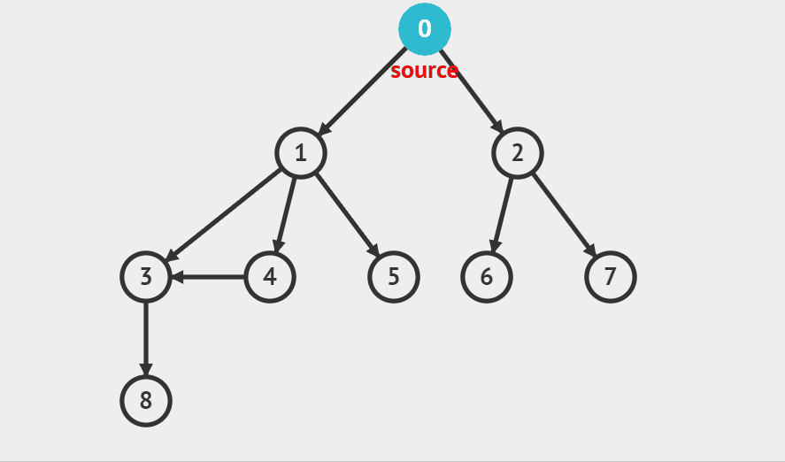

# BFS

<figure><figcaption></figcaption></figure>

로직은 아래와 같습니다.

* 동영상에서 보이듯 시작 노드를 방문하고 해당 노드에 연결되어 있는 노드들을 전부 방문합니다.
* 다음으로 그 노드들에서 위 BFS를 다시 진행합니다.


구현은 큐를 사용합니다. 아래는 위 그래프에서 큐에 들어가고 나가는 요소들의 모습입니다.\
 (1).png>)

먼저 루트 노드인 0이 들어갔다 나오면서 0과 연결된 1과 2를 append시킵니다. 이후 1을 popleft시키면서 1과 연결된 3,4,5 노드를 append시킵니다. 다음으로 popleft되는 것은 노드3이 아닌 노드2입니다. 선입선출이라는 특징으로 인해 bfs는 큐로 구현할 때 강력할 수밖에 없겠죠?

```python
from collections import deque

def bfs(graph, start, visited):
    queue=deque([start])
    visited[start] = True
    while queue:
        v = queue.popleft()
        print(v, end=' ')
        for i in graph[v]:
            if not visited[i]:
                queue.append(i)
                visited[i] = True

graph = [
    [1,2], #0번 노드에서 1과 2로 이동 가능하다.
    [3, 4, 5], #1번 노드에서 2,3,8로 이동 가능하다.
    [6,7], #2번 노드에서 1,7로 이동 가능하다.
    [8],
    [3],
    [],
    [],
    [],
    []
]

visited = [False] * 9

bfs(graph, 0, visited) #출력 : 0 1 2 3 4 5 6 7 8 
```



BFS로 그래프를 탐색하며 현재 탐색하는 노드A에서 갈 수 있는 노드B에 현재 노드 값(A)의 +1을 합니다. \
그리고 또 다시 노드B로 이동합니다.

이런 식으로 모든 노드들을 탐색을 마치면 찾고자 하는 노드의 인덱스의 값을 출력해주면 됩니다.

```python
from collections import deque

def bfs(node):
    queue = deque()
    queue.append(node)
    while queue:
        node = queue.popleft()
        for n in graph[node]:
            if check[n] == 0:
                check[n] = check[node]+1
                queue.append(n)
            
n = int(input())
graph = [[] for _ in range(n+1)]
s, e = map(int, input().split())
for _ in range(int(input())):
    u, v = map(int, input().split())
    graph[u].append(v)
    graph[v].append(u)
check = [0]*(n+1)
bfs(s)
print(check[e] if check[e] > 0 else -1)
```

기본 알고리즘 시간에 배웠던 floodfill도 기본적으로 bfs 로직입니다.\
direction 방향을 선택하여 상하좌우부터 탐색하는 bfs 로직이라고 보시면 됩니다.

```python
direction = [(0,1),(1,0),(-1,0),(0,-1)]
```
