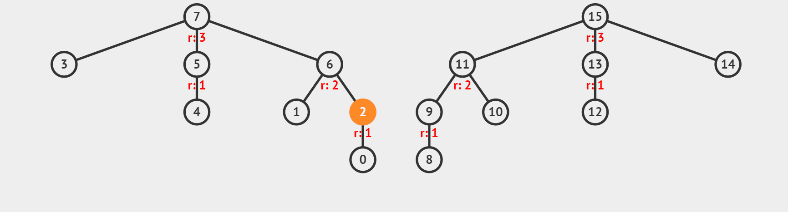
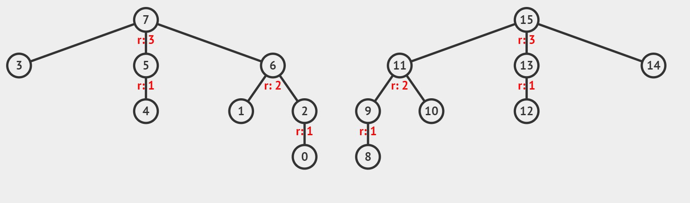

# 유니온 파인드(분리집합)

이름에서 알 수 있듯이 Union과 Find  함수를 구현하는 알고리즘입니다.\
아래와 같이 그래프(집합) 두 개가 존재합니다. 일단 왼쪽 그래프(집합)는 대표가 root노드인 7이고, 오른쪽 그래프(집합)는 대표가 root 노드인 15에 해당합니다.

<figure><figcaption></figcaption></figure>

먼저 다음 물음에 답해봅시다.

4와 13은 같은 그래프(집합)에 해당할까요? 답은 아니다 겠죠?\
그리고 3과 6은 같은 그래프(집합)에 해당한다고 말할 수 있을 겁니다.

우리는 이 질문들에 왼쪽 그래프(집합)의 대표는 7이고, 오른쪽 그래프(집합)의 대표는 15인 것으로 판단내릴 수 있습니다. 이것이 유니온 파인드 중 파인드에 해당합니다.

> **Find**\
> 노드 x가 어느 집합에 포함되어 있는지 찾는다.

이 로직은 재귀함수로 구현할 수 있는데요, 일단 노드 0부터 15까지를 배열로 초기화시킵니다.

```python
parent = [i for i in range(0, n + 1)]
```

이후 재귀함수로 루트노드로 모두 집합시키는 경로 압축 최적화를 진행합니다.

```
def find(target):
    if target == parent[target]:
        return target
    #경로 압축 최적화 - 루트노드로 모두 집합!!
    parent[target]=find(parent[target])
    return parent[target]
```

이 때 중요한 것은 '찾을 때' parent 배열이 갱신된다는 점입니다. \
위 상황에서 우리가 아래 세연산을 진행하면 배열이 동영상의 모습처럼 갱신되는 것을 볼 수 있습니다.

find(2)\
find(0)\
find(4)

<figure><figcaption></figcaption></figure>


다음은 위 집합 두 개를 합치고 싶습니다. \
숫자 6에 해당하는 집합과 숫자 13에 해당하는 집합을 합치고자 합니다.

> **Union**\
> 노드 x가 포함된 집합과 노드 y가 포함된 집합을 합친다.

로직은 간단합니다. 노드 7의 parent를 15로 지정해줍니다.

<figure><figcaption></figcaption></figure>

위 동영상에서는 값이 더 큰 15를 기준으로 7을 15에 합쳐주었는데, 아래 코드에서는 작은 것을 기준으로 하여 합쳐주는 코드입니다. (어떻게 해도 상관은 없습니다.)

이 때 핵심은 일단 집합의 상위 노드를 우선 찾고, 그 상위 노드들끼리 합쳐주어야 한다는 것입니다.

```python
def union(a,b):
    a = find(a)
    b = find(b)
    #작은 루트 노드 기준으로 합치라!! 같은 그룹으로 묶기
    if a==b: return 
    if a < b:
        parent[b]=a
    else:
        parent[a]=b
```



유니온파인드의 가장 기본이 되는 문제를 풀어봅시다.

```python
import sys
sys.setrecursionlimit(10**6)
input = sys.stdin.readline

def find(target):
    if target == parent[target]:
        return target
    #경로 압축 최적화 - 부모노드로 모두 집합!!
    parent[target]=find(parent[target])
    return parent[target]

def union(a,b):
    a = find(a)
    b = find(b)
    #작은 루트 노드 기준으로 합치라!! 같은 그룹으로 묶기
    if a==b: return 
    if a < b:
        parent[b]=a
    else:
        parent[a]=b

N,M=map(int,input().split())
parent=[i for i in range(N+1)]

for _ in range(M):
    x, a, b = map(int,input().split())
    if x ==0: union(a,b)
    else: 
        if find(a)==find(b): print('YES')
        else: print("NO")
```


유니온파인드는 무방향 그래프에서의 사이클 판단에 매우 강력한데요,

사이클\
어떤 정점에서 시작하여 다시 자신에게 돌아오는 경로가 있다면 이를 사이클(cycle)이라고 합니다.

다음 문제를 봅시다.&#x20;



위 그래프에서 잠깐 예시를 들어보면, 만약 3과 4를 잇는다라고 한다면 이는 3-7-5-4의 사이클을 만드는 것 알 수 있습니다.&#x20;

 (1).png>)

따라서 위 문제에서 만약 입력받은 두 수의 집합이 같다면 사이클을 만든다는 것을 알 수 있습니다. 위 로직은 다음에 배울 크루스칼에서 나오게 되니 잘 봐두세요!

```python
#사이클 판단
#union find

import sys
input=sys.stdin.readline
# find 연산
def find(target):
    if target == parent[target]:
        return target
 
    # 경로 압축 최적화
    parent[target] = find(parent[target])
    return parent[target]
 
# union 연산
def union(a, b):
    a = find(a) 
    b = find(b)
 
    # 작은 루트 노드를 기준으로 합침
    if a < b:
        parent[b] = a
    else:
        parent[a] = b

N,M=map(int,input().split())

parent = [i for i in range(N)]
 
for j in range(M):
    x,y=map(int,input().split())
    if find(x)==find(y):print(j+1); exit()
    union(x,y)

print(0)
```

