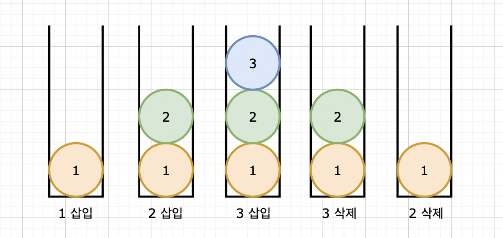

# 그리디

학생 A는 지금까지 모은 저금통을 깨기 위해 돼지저금통을 들고 마트에 갔습니다.\
.png>).png>)

돼지 저금통에는 500원짜리 동전, 100원짜리 동전, 50원짜리 동전, 10원짜리 동전, 5원짜리 동전, 1원짜리 동전이 부족하지 않게 들어있습니다.

학생 A가 먹고 싶은 과자들을 다 담고난 후 계산대에서 계산해보니 총 380원이 남았습니다.

어떻게 내는 것이 가장 효율적일까요? 아마도 100원짜리 3개, 50원짜리 1개, 10원짜리 3개를 지불하는 것이 가장 효율적일 것입니다. 가장 큰 비용의 동전부터 모자라지 않게 이기적으로 채워나간다고 해서 Greedy, 탐욕스러운 선택 알고리즘이라고 부릅니다.

Greedy는 구현은 어렵지 않으나, 해당 문제를 Greedy하게 풀 수 있다는 증명을 해내는 과정이 까다로운데요, 그래서 많이 연습해보고, 문제풀이 시 왜 그리디가 가능한지 이해하는 것 또한 중요합니다.



```python
a = 1000 - int(input())
b = [500, 100, 50, 10, 5, 1]
count = 0
for i in b:
    count += a // i
    a %= i
print(count)
```


다음으로 유명한 그리디 문제로 회의실 배정 문제가 있습니다.



다음과 같이 회의 여러 개가 잡혀 있다고 합시다. 가장 많은 회의를 진행하기 위한 회의실 배정 방법은 무엇일까요??

<figure><figcaption></figcaption></figure>

일단 이런 생각을 해볼 수 있겠죠?\
❓가장 짧은 애들을 넣어볼까?\
하지만 아래 상황이 반례가 됩니다.




❓가장 적게 겹치는 애들부터 넣어볼까?\
하지만 아래 상황이 반례가 됩니다.\
.png>)


❗답은 가장 빨리 끝내는 애들부터 넣어야 한다는 것인데요,

만약 회의가 끝나는 시간들을 각각 {1,...n}이라고 해봅다.\
그러면 정답은 1을 포함하거나 포함하지 않거나 둘 중 하나일 겁니다.

정답이 1을 포함하지 않는다면, 정답의 첫 번째 답이 1과 겹치지 않는다면, 1을 넣어서 답을 하나 더 길게 만들 수 있으므로 모순입니다.

하지만 정답의 첫번째 답이 1과 겹친다면, 첫번째 답은 1보다 늦게 끝나므로, 이를 빼고 1을 넣으면 여전히 답이 됩니다.

**따라서 정답은 반드시 1을 포함합니다.**&#x20;

이제 1을 제외한 나머지는 차례대로 겹치지 않는 것들 중에 **빨리 끝나는 것들을 고르면 됩니다**. 빨리 끝나는 것들 중에서도 늦게 시작하는 애들을 고르는 것이 겹치지 않을 수 있는 확률이 더 큽니다. 따라서 **정렬 기준을 1. 끝나는 시간의 오름차순 2. 시작하는 시간의 오름차순으로 해준 후** 처리하는 것이 유리합니다.

```python
import sys

N = int(sys.stdin.readline())

time = [[0]*2 for _ in range(N)]
for i in range(N):
    s, e = map(int, sys.stdin.readline().split())
    time[i][0] = s
    time[i][1] = e

time.sort(key = lambda x: (x[1], x[0]))

cnt = 1
end_time = time[0][1]
for i in range(1, N):
    if time[i][0] >= end_time:
        cnt += 1
        end_time = time[i][1]

print(cnt)
```

