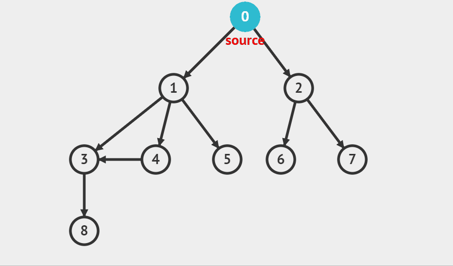

# BFS

<figure><figcaption></figcaption></figure>

로직은 아래와 같습니다.

* 동영상에서 보이듯 시작 노드를 방문하고 해당 노드에 연결된 다음 노드에 방문, 그 다음 연결된 노드에 방문을 반복합니다.
* 그러다 (연결이 안되어 있으면) or (모두 방문한 노드라면) 이전 노드로 이동 후 연결된 노드(방문이 안된 노드)에 대해 다시 DFS를 수행합니다.

구현은 큐를 사용합니다.

\+위상정렬도 소개
