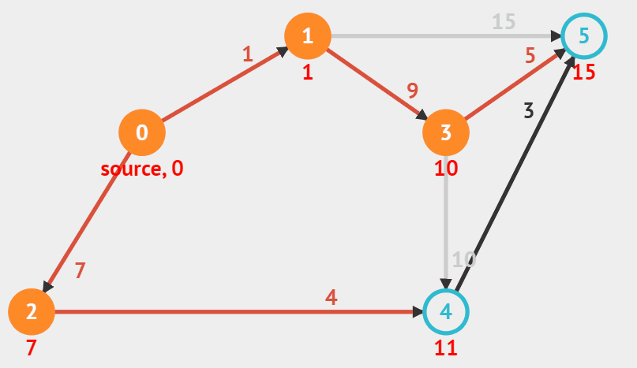

# 다익스트라 X

.png>)

위 그래프를 봅시다.\
우리는 먼저 다익스트라 알고리즘을 풀기 위한 그래프의 조건을 알아야 합니다.\
다익스트라는 위 그림처럼 음수 가중치를 갖지 않는 유향 그래프여야 합니다.

또한 출발점이 정해져있습니다. 위 그림에서는 파란색으로 칠해져 있는 0번 노드입니다.\
이 출발점으로부터 각 노드까지의 최단경로를 모두 구할 수 있습니다.

다익스트라는 다음과 같이 작동합니다.

① 아직 방문하지 않은 정점들 중 거리가 가장 짧은 정점을 하나 선택해 방문한다.\
② 해당 정점에서 인접하고 아직 방문하지 않은 정점들의 거리를 갱신한다.

맨 처음에는 시작점으로의 거리만 0이고 나머지는 다 거리가 무한(Inf)입니다. 정점 i, j 사이의 거리를 d, 거리 테이블을 dist라고 부르겠습니다.


먼저 시작점에서 갈 수 있는 정점은 1과 7이 있습니다. 이 둘까지의 거리 정보를 통해,  노드 1까지의 최소거리는 1, 노드2까지의 최소거리는 7로 갱신됩니다.

그러면 dist 배열은 다음과 같이 갱신됩니다.

|  0 | 1 | 2 | 3   | 4   | 5   |
| -- | - | - | --- | --- | --- |
| 0  | 1 | 7 | inf | inf | inf |


그 다음, 아직 방문하지 않은 정점 중 dist가 제일 작은 곳이 1번이므로 1번 정점을 방문하여 인접한 3, 5번 정점의 거리 갱신을 시도합니다.

위와 같은 논리로 노드1에서 노드3까지의 거리는 9, 노드1에서 노드5까지의 거리는 15로 갱신됩니다.\
따라서 노드0에서 노드 3까지의 거리는 10, 노드 5까지의 거리는 16으로 갱신되겠죠?

|  0 | 1 | 2 | 3  | 4   | 5  |
| -- | - | - | -- | --- | -- |
| 0  | 1 | 7 | 10 | inf | 16 |


이제 위 dist에서 아직 방문하지 않은 정점 중 dist가가장 작은 노드2에서부터 거리를 갱신합니다.\
노드2를 거쳐 노드4로 가는 최소 거리는 7+4=11입니다.

|  0 | 1 | 2 | 3  | 4  | 5  |
| -- | - | - | -- | -- | -- |
| 0  | 1 | 7 | 10 | 11 | 16 |


다음으로 아직 방문하지 않은 정점 중 dist가 가장 작은 노드3을 통해 가는 경로를 갱신합니다.\


5번 노드는 dist\[3]+d\[3]\[5]가 dist\[5]보다 작기 때문에 갱신됩니다.\
여기서 노드4의 경우에는 거리가 갱신되지 않습니다. 이미 이전 경로가 더 가깝기 때문이죠.

|  0 | 1 | 2 | 3   | 4   | 5   |
| -- | - | - | --- | --- | --- |
| 0  | 1 | 7 | inf | inf | inf |



|  0 | 1 | 2 | 3   | 4   | 5   |
| -- | - | - | --- | --- | --- |
| 0  | 1 | 7 | inf | inf | inf |

\




```python
import sys
input = sys.stdin.readline
sys.setrecursionlimit(10**6)

import heapq

# 정점의 개수 n, 간선의 개수 m
n, m = map(int, input().split())

# 시작 정점의 번호
k = int(input())

# 무한을 의미하는 INF
INF = int(1e9)

# 그래프 초기화
graph = [[] * (n+1) for _ in range(n+1)]
# 최단 거리 테이블을 모두 무한으로 초기화
distance = [INF] * (n+1)

# 간선 정보 입력
for _ in range(m):
    a, b, c = map(int, input().split())
    # a->b가 c비용
    graph[a].append((b, c))


def dijkstra(start):
    q = []
    # 시작 노드로 가기 위한 최단 경로는 0으로 설정하여, 큐에 삽입
    heapq.heappush(q, (0, start))
    distance[start] = 0

    while q:
        # 가장 최단 거리가 짧은 노드에 대한 정보 꺼내기
        dist, now = heapq.heappop(q)
        # 현재 노드가 이미 처리된 적이 있는 노드라면 무시
        if distance[now] < dist:
            continue
        # 현재 노드와 연결된 다른 인접한 노드들을 확인
        for i in graph[now]:
            cost = dist + i[1]
            # 현재 노드를 거쳐서, 다른 노드로 이동하는 거리가 더 짧은 경우
            if cost < distance[i[0]]:
                distance[i[0]] = cost
                heapq.heappush(q, (cost, i[0]))

# 다익스트라 알고리즘을 수행
dijkstra(k)

# 모든 노드로 가기 위한 최단 거리를 출력
for i in range(1, n+1):
    if distance[i] == INF:
        print("INF")
    else:
        print(distance[i])
```


