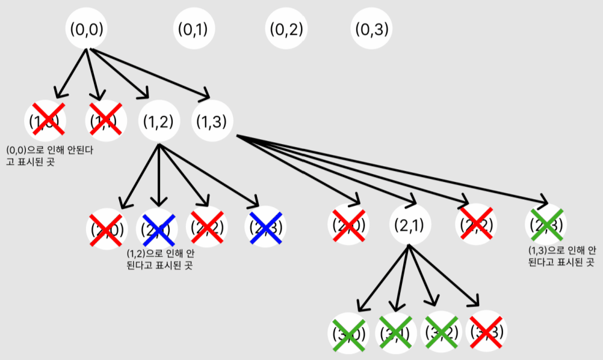

# 완전탐색 (백트래킹) O

백트래킹 유형을 가장  잘 보여주는 백준 온라인 저지의 9663번 N-Queen 문제를 함께 살펴봅시다.\




N-Queens 문제의 규칙은 퀸이 놓였을 때 퀸 자신을 기준으로 일직선상(가로 및 세로)과 대각선 방향에는 아무것도 놓여있으면 안 된다는 것이고, 우리는 **4번째 줄까지 퀸을 놓는 경우의 수**를 구하고 싶습니다.

예를 들어 아래와 같이 퀸의 가로에 퀸을 놓을 수 없습니다.

 (1).png>)

우리가 어떤 과정을 거쳐 판단을 내릴 수 있을지 봅시다.\


<figure><figcaption></figcaption></figure>

이를 우리는 그래프 재귀 형태로 이해해볼 수 있는데요,\
.png>)(0,0)을 선택할 경우 아래 4가지 경우를 선택할 수 있습니다.

하지만 이 때, 가로/세로/대각선은 가면 안된다는 조건 때문에 (1,0)과 (1,1)은 더 가 볼 필요도 없겠죠?\
이 "**더 가볼 필요 없다**"라는 점이 백트래킹에서 중요합니다. 가지치기를 통해 더이상 조건에 맞지 않으면 가지 않는 것이 백트래킹의 큰 특징입니다.

이후 그래프를 더 파악해봅시다.\
.png>)(1,2)를 탐색해본 후더이상 갈 수 없다는 것을 알았습니다.

이런 경우 다시 이전으로 돌아와 다른 경우 즉 (1,3)을 탐색하기 시작합니다. 이렇게 **조건에 맞지 않으면 이전으로 돌아오는 것**이 백트래킹의 두번째 중요한 특징입니다.

.png>)(1,3)->(2,1)로 선택했을 때에도 안 되는 경로임을 알았습니다.

이 때는 이제 어디로 가야 할까요??&#x20;

...

맞아요! 바로 (0,1)로 가야 합니다.


다음과정을 전체적으로 확인하면 다음과 같습니다. \
"가지치기", "이전으로 돌아가서 다른 선택지 확인"에 초점을 두고 파악해봅시다!

<figure><figcaption></figcaption></figure>

위 동영상에서도 볼 수 있듯이, 백트래킹은 재귀함수로 구현합니다.

```python
n = int(input())

ans = 0
row = [0] * n

def is_promising(x):
    for i in range(x):
        if row[x] == row[i] or abs(row[x] - row[i]) == abs(x - i):
            #+나 X 형태의 경우는 갈 수 없다. 가지치기
            return False
    return True

def n_queens(x):
    global ans
    if x == n:
        ans += 1
        return
    else:
        for i in range(n):
            # [x, i]에 퀸을 놓겠다.
            row[x] = i
            if is_promising(x):
                n_queens(x+1)

n_queens(0)
print(ans
```

위 코드를 간단히 확인해보면 is\_promising함수는 (1,0) (2,0) 등 세로의 경우와 (1,1)과 (2,2)의 대각선 경우를 가지치기하는 코드입니다.&#x20;

이후 n\_queens는 이미 재귀함수로 짜여져 있어 if문에 적용이 되지 않으면 자동적으로 이전 경우로 돌아가 다른 경우를 탐색함을 알 수 있습니다.


더 풀어볼 문제로는 N과 M 시리즈가 있습니다.


백트래킹을 이해해보며 추가적인 내용을 익혀봅시다! 위 동영상처럼 그림을 그려보면 이해에 도움이 됩니다.


조금 어렵지만 코딩테스트에 나올 수 있는 문제


사다리 타기, Grid World는 백트래킹을 표현하는 수단으로 자주 출제됩니다.


